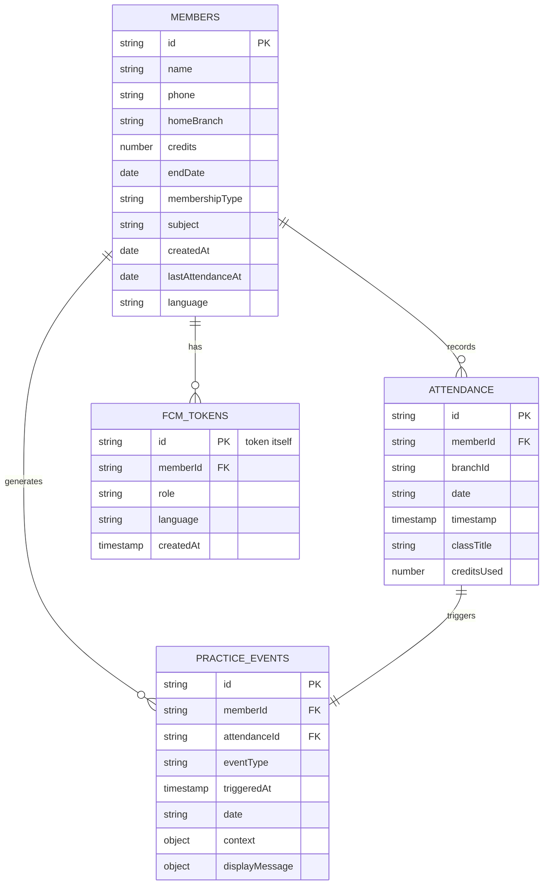

# Data Schema Documentation

**복샘?”ê? ?œìŠ¤???°ì�´?°ë² ?´ìŠ¤ ?¤í‚¤ë§?*

??문서??Firestore 컬렉??구조, ?„ë“œ ?•ì�˜, ê´€ê³? 그리ê³??¸ë�±?¤ë? ?•ì�˜?©ë‹ˆ??

---

## ?“Š ERD (Entity Relationship Diagram)



---

## 1�⃣ `members` Collection

### ?¤ëª…
?Œì›� ?•ë³´ë¥??€?¥í•˜???µì‹¬ 컬렉?? 모든 출ì„�, ?Œë¦¼, ?´ë²¤?¸ì�˜ 기ì????©ë‹ˆ??

### ?„ë“œ (Fields)

| ?„ë“œëª?| ?€??| ?„수 | ?¤ëª… | ?ˆì‹œ |
|---|---|---|---|---|
| `id` | string | ??| ?�� ?�성 문서 ID (Firestore) | `xjk2n3kl...` |
| `name` | string | ??| ?Œì›� ?´ë¦„ | `?�길?? |
| `phone` | string | ??| ?„화번호 (??4?�리??PIN) | `010-1234-5678` |
| `homeBranch` | string | ??| 기본 지??| `mapo` or `gwangheungchang` |
| `credits` | number | ??| ?”ì—¬ ?¬ë ˆ??(무제??999) | `10` |
| `endDate` | string | ??| ?Œì›�ê¶?만료??(YYYY-MM-DD) | `2026-12-31` |
| `membershipType` | string | ? ï¸� | ?Œì›�ê¶?? í˜• | `regular`, `advanced`, `flying` |
| `subject` | string | ? ï¸� | ?Œì›�ê¶?명칭 | `10?Œê¶Œ`, `무제?? |
| `createdAt` | timestamp | ??| ?±ë¡�??| `Timestamp(...)` |
| `lastAttendanceAt` | timestamp | ? ï¸� | 최근 출ì„� ?œê°� | `Timestamp(...)` |
| `language` | string | ? ï¸� | ? í˜¸ ?¸ì–´ | `ko`, `en`, `ru`, `zh`, `ja` |

### ?¸ë�±??(Indexes)
- `phone` (ASC) - PIN 로그?¸ìš©
- `endDate` (ASC) - 만료 ?ˆì • ?Œì›� 조회??
- `credits` (ASC) - ?€?¬ë ˆ???Œì›� 조회??

### 보안 규칙 (Security Rules)
```javascript
// Anonymous users: READ only their own data
// Admin (authenticated): READ/WRITE all
match /members/{memberId} {
  allow read: if request.auth != null && request.auth.uid == memberId;
  allow write: if request.auth != null && request.auth.token.email != null;
}
```

---

## 2�⃣ `attendance` Collection

### ?¤ëª…
출ì„� 기ë¡�???€?¥í•˜??컬렉?? `practice_events` ?�성???¸ë¦¬ê±°ê? ?©ë‹ˆ??

### ?„ë“œ (Fields)

| ?„ë“œëª?| ?€??| ?„수 | ?¤ëª… | ?ˆì‹œ |
|---|---|---|---|---|
| `id` | string | ??| ?�� ?�성 문서 ID | `abc123...` |
| `memberId` | string | ??| ?Œì›� ID (FK to members) | `xjk2n3kl...` |
| `branchId` | string | ??| 출� 지??| `mapo` |
| `date` | string | ??| 출ì„� ? ì§œ (YYYY-MM-DD) | `2026-01-20` |
| `timestamp` | timestamp | ??| 출ì„� ?œê°� | `Timestamp(...)` |
| `classTitle` | string | ? ï¸� | ?˜ì—…ëª?(? íƒ�) | `?Œë�¼?‰ìš”ê°€ ?¬í™”` |
| `creditsUsed` | number | ??| ì°¨ê°� ?¬ë ˆ??| `1` |

### ?¸ë�±??(Indexes)
- `memberId` (ASC) + `date` (DESC) - ?Œì›�ë³?출ì„� ?´ë ¥ 조회
- `date` (ASC) - ?¹ì • ? ì§œ 출ì„� 집계
- Composite: `memberId` + `date` + `timestamp` (DESC)

### Functions Trigger
```javascript
exports.onAttendanceCreated = onDocumentCreated("attendance/{attendanceId}", ...)
```
??출ì„� ?�성 ???�ë�™?¼ë¡œ `practice_events` 계산 ë°??�성

---

## 3�⃣ `practice_events` Collection

### ?¤ëª…
**Silent Recorder ì² í•™???µì‹¬**. 출ì„� ?¨í„´ ë³€?”ë? AI ?†ì�´ 계산?˜ì—¬ ?´ë²¤?¸ë¡œ ?€?¥í•©?ˆë‹¤.

### ?„ë“œ (Fields)

| ?„ë“œëª?| ?€??| ?„수 | ?¤ëª… | ?ˆì‹œ |
|---|---|---|---|---|
| `id` | string | ??| ?�� ?�성 문서 ID | `evt123...` |
| `memberId` | string | ??| ?Œì›� ID (FK to members) | `xjk2n3kl...` |
| `attendanceId` | string | ??| ?¸ë¦¬ê±°ë�œ 출ì„� ID (FK) | `abc123...` |
| `eventType` | string | ??| ?´ë²¤???€??(ENUM) | `FLOW_RESUMED` |
| `triggeredAt` | timestamp | ??| ?´ë²¤???�성 ?œê°� | `Timestamp(...)` |
| `date` | string | ??| 출ì„� ? ì§œ (YYYY-MM-DD) | `2026-01-20` |
| `context` | object | ??| 계산??컨í…�?¤íŠ¸ | `{ gapDays: 14, streak: 1 }` |
| `displayMessage` | object | ??| ?¤êµ­??메시지 ?œí”Œë¦?| `{ ko: "...", en: "..." }` |

### ?´ë²¤???€??(Event Types - ENUM)

#### A. Practice Events (?˜ë ¨ 리듬 ?´ë²¤??
| ?€??| ?¤ëª… | ?�성 ì¡°ê±´ |
|---|---|---|
| `PRACTICE_COMPLETED` | ?˜ë ¨ 기ë¡� ?„료 (기본) | 모든 출ì„� |
| `FLOW_MAINTAINED` | 리듬 ? ì? | gap < 7??|
| `GAP_DETECTED` | 간격 발� | 7????gap < 30??|
| `FLOW_RESUMED` | ë³µê? | gap ??30??|
| `PATTERN_SHIFTED` | ?œê°„?€ ë³€??| timeBand ë³€ê²?ê°�ì? |

#### B. Context Object Structure
```javascript
{
  gapDays: 14,              // ?´ì „ 출ì„�ê³¼ì�˜ 간격
  streak: 1,                 // ?°ì†� 출ì„� ?¼ìˆ˜
  timeBand: "MORNING",       // ?„ì�¬ ?œê°„?€
  previousTimeBand: "EVENING", // ?´ì „ ?œê°„?€
  shiftDetails: "EVENING ??MORNING" // ?¨í„´ ë³€???�세
}
```

### ?¸ë�±??(Indexes)
- `memberId` (ASC) + `triggeredAt` (DESC) - ?Œì›�ë³?최신 ?´ë²¤??조회
- `eventType` (ASC) + `triggeredAt` (DESC) - ?´ë²¤???€?…별 ?„í„°ë§?

---

## 4�⃣ `fcm_tokens` Collection

### ?¤ëª…
Firebase Cloud Messaging ?¸ì‹œ ?Œë¦¼??? í�°???€?¥í•©?ˆë‹¤. Primary Key??? í�° ?�ì²´?…니??

### ?„ë“œ (Fields)

| ?„ë“œëª?| ?€??| ?„수 | ?¤ëª… | ?ˆì‹œ |
|---|---|---|---|---|
| `id` | string | ??| FCM ? í�° (PK) | `eXjk2n3...` |
| `memberId` | string | ? ï¸� | ?Œì›� ID (null=? ë ¹ ? í�°) | `xjk2n3kl...` or `null` |
| `role` | string | ??| ??•  | `member`, `admin`, `kiosk` |
| `language` | string | ??| ? í˜¸ ?¸ì–´ | `ko` |
| `createdAt` | timestamp | ??| ? í�° ?�성 ?œê°� | `Timestamp(...)` |

### ? ë ¹ ? í�° (Ghost Tokens)
- **?•ì�˜**: `memberId === null`??? í�°
- **?�ì�¸**: 로그?„웃 ??미삭?? ???¬ì„¤ì¹???
- **?•ë¦¬**: `cleanupGhostTokens` ?¤ì?줄러 (매주 ?¼ìš”??04:00 KST)

### ?¸ë�±??(Indexes)
- `memberId` (ASC) - ?Œì›�ë³?? í�° 조회
- `role` (ASC) - ??• ë³??„í„°ë§?
- Composite: `memberId` (ASC) + `createdAt` (DESC)

---

## 5ï¸�⃣ 기í? 컬렉??(Supporting Collections)

### `notices`
- **?¤ëª…**: ê³µì??¬í•­
- **주요 ?„ë“œ**: `title`, `body`, `date`, `isPinned`

### `messages`
- **?¤ëª…**: 1:1 문ì�˜/?€??(관리ì�� ???Œì›�)
- **주요 ?„ë“œ**: `memberId`, `content`, `sender`, `timestamp`

### `images`
- **?¤ëª…**: ?????´ë?지 ?�ì‚°
- **주요 ?„ë“œ**: `url`, `base64`

### `ai_error_logs`
- **?¤ëª…**: AI API ?¸ì¶œ ?¤íŒ¨ 로그
- **주요 ?„ë“œ**: `context`, `error`, `timestamp`
- **?©ë�„**: 모니?°ë§� ë°??”버ê¹?

### `error_logs`
- **?¤ëª…**: ?´ë�¼?´ì–¸???�러 로그
- **주요 ?„ë“œ**: `message`, `url`, `userId`, `timestamp`

---

## ?”� 보안 ë°?최ì �???�ì¹™

### 1. Protected Logic (Server-Side Only)
?¤ì�Œ ?‘ì—…?€ **반드??Cloud Functions**?�ì„œë§??¤í–‰:
- ?¬ë ˆ??ì°¨ê°� (`checkInMemberV2Call`)
- ?Œì›�ê¶?만료 ì²´í�¬ (`checkExpiringMembersV2`)
- ?Œìˆ˜ ?¬ë ˆ??ê°�ì? (`onMemberUpdateSecurityAlertV2`)

### 2. ?´ë�¼?´ì–¸???œí•œ
- **Kiosk Mode**: Firestore 리스??비활?±í™” (?±ëŠ¥ 최ì �??
- **Member Mode**: 본ì�¸ ?°ì�´?°ë§Œ ?½ê¸° ê°€??
- **Admin Mode**: ?´ë©”???¸ì¦� ?„수

### 3. ?¸ë�±???„ë�µ
- **복합 ?¸ë�±??*: ?�주 ?¬ìš©?˜ëŠ” 쿼리 ì¡°í•©
- **ASC/DESC ?¼ìš©**: ?•ë ¬ ë°©í–¥ 명시
- **?„í„° + ?•ë ¬**: Firestore ?œì•½ ê³ ë ¤

---

## ?“ˆ ?•ì�¥ 계íš� (미구??

### ?¥í›„ 추ê? ?ˆì • 컬렉??

#### `membership_events`
- ?Œì›�ê¶?ë³€ê²??°ì�¥ ?´ë ¥
- ?„ë“œ: `memberId`, `eventType`, `oldPlan`, `newPlan`

#### `class_sessions`
- ?˜ì—…ë³?출ì„� 집계
- ?„ë“œ: `branchId`, `classTitle`, `date`, `attendeeIds[]`

#### `inflection_points` (관리�??
- 변곡ì � ?Œì›� 리스??
- ?„ë“œ: `memberId`, `reason`, `severity`, `actionTaken`

---

## ?› ï¸?? ì?보수 ê°€?´ë“œ

### Schema 변�??체�리스??
1. ????문서 ?…ë�°?´íŠ¸
2. ??`firestore.indexes.json` ?˜ì •
3. ??Cloud Functions 코드 ?˜ì •
4. ???´ë�¼?´ì–¸??코드 ?˜ì •
5. ??마ì�´ê·¸ë ˆ?´ì…˜ ?¤í�¬ë¦½íŠ¸ ?‘성 (?„ìš”??

### ?¸ë�±??ë°°í�¬
```bash
firebase deploy --only firestore:indexes
```

---

**Last Updated**: 2026-01-20  
**Author**: Antigravity AI Agent  
**Status**: Production
